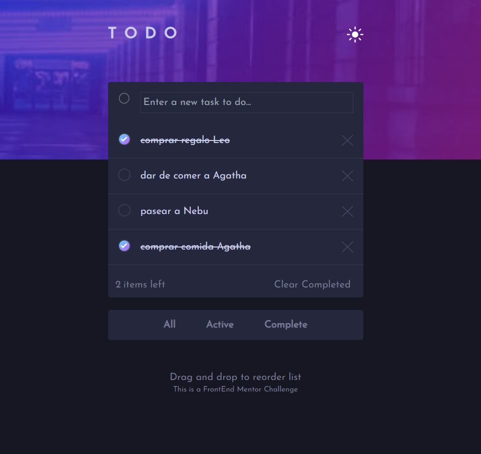
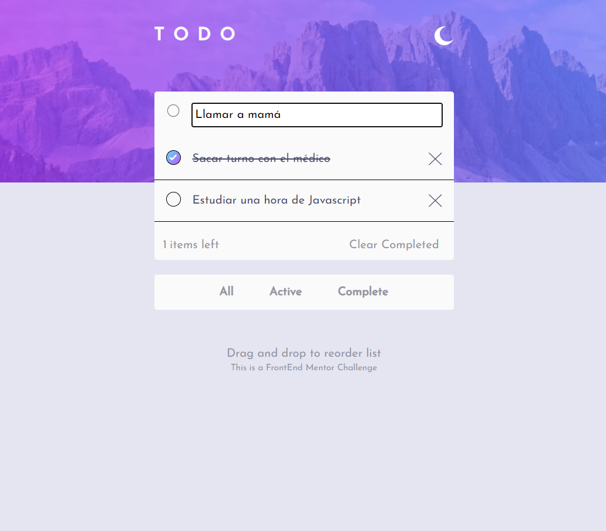

# Frontend Mentor - Todo app solution

This is a solution to the [Todo app challenge on Frontend Mentor](https://www.frontendmentor.io/challenges/todo-app-Su1_KokOW). Frontend Mentor challenges help you improve your coding skills by building realistic projects. 

## Table of contents

- [Overview](#overview)
  - [The challenge](#the-challenge)
  - [Screenshot](#screenshot)
  - [Links](#links)
- [My process](#my-process)
  - [Built with](#built-with)
  - [What I learned](#what-i-learned)
  - [Continued development](#continued-development)
  - [Useful resources](#useful-resources)
- [Author](#author)
- [Acknowledgments](#acknowledgments)


## Overview

### The challenge

Users should be able to:

- View the optimal layout for the app depending on their device's screen size
- See hover states for all interactive elements on the page
- Add new todos to the list
- Mark todos as complete
- Delete todos from the list
- Filter by all, active or complete todos
- Clear all completed todos
- Toggle light and dark mode
- Drag and drop to reorder items on the list
- Todos will be fixed in the Local Storage

### Screenshot





### Links

- Solution URL: [https://todoapp-conti.vercel.app/](https://todoapp-conti.vercel.app/)

## My process

### Built with

- Semantic HTML5 markup
- CSS custom properties
- Flexbox
- CSS Grid
- Mobile-first workflow
- [React](https://reactjs.org/) - JS library
- [Tailwind](https://tailwindcss.com/) - React framework


### What I learned
Doing this project I learned many things. First, I used the React library for the first time. I learned to work with components, separating them into modules and connecting them to each other, and to use props and state to get data.

On the other hand, to style the app, I used the Tailwind Css framework also for the first time. I found it a very interesting tool to work with styles in an agile and dynamic way. I customized some classes like the colors to respect the palette required for this project.

I learned how to switch from light mode to dark mode and vice versa.
I went over the drag and drop function and the use of Local Storage.
I reinforced Javascript concepts and methods like filter, map, etc.

<!-- Haciendo este proyecto aprendí muchas cosas. Por un lado, utilicé la biblioteca de React por primera vez. Aprendí a trabajar mediante componentes, separando en módulos y conectándolos entre si, y a usar props y state para obtener datos.
Por otro lado, para dar estilo a la app, utilicé el framework Tailwind Css también por primera vez. Me pareció una herramienta muy interesante para trabjar de manera ágil y dinámica los estilos. Personalicé algunas clases como los colores para respetar la paleta requerida para este proyecto.
Aprendí a cambiar de modo claro a modo oscuro y viceversa.
Repasé la función de drag and drop y el uso de Local Storage.
Reforcé conceptos y métodos de Javascript como filter, map, etc. -->


#### Tailwind personalized classes
```js
module.exports = {
  content: ['./index.html', './src/**/*.{js,jsx}'],
  theme: {
    colors: {
      // dark theme
      'very-dark-blue': 'hsl(235, 21%, 11%)',
      'very-dark-desaturated-blue': 'hsl(235, 24%, 19%)',}
  }
}
```


### Continued development

In future projects I would like to implement React again to continue exploring its functionalities and reinforce what I have learned.

This project could be expanded by allowing subtasks and lists separated by categories.

<!-- En proyectos futuros me gustaría volver a implementar React para seguir explorando sus funcionalidades y reforzar lo aprendido.

Este proyecto podría agrandarse permitiendo hacer subtareas y listas separadas por categorías. -->


### Useful resources

- [Tailwind Cheat Sheet](https://tailwindcomponents.com/cheatsheet/) - This website makes Tailwind easy to use as it lists all classes separated by category and provides a very handy search engine.
- [Drag and drop tutorial](https://www.freecodecamp.org/news/how-to-add-drag-and-drop-in-react-with-react-beautiful-dnd/) - This article explains how to use drag and drop using React Beautiful DnD


## Author

- Website - [Mariana Conti portfolio](https://marianaconti.vercel.app)
- Frontend Mentor - [@marianacont](https://www.frontendmentor.io/profile/marianacont)
- FreeCodeCamp - [@MarianaConti](https://www.freecodecamp.org/MarianaConti)


## Acknowledgments

To carry out this project, the React course from [Gluu web](https://bluuweb.dev/) was very helpful.
